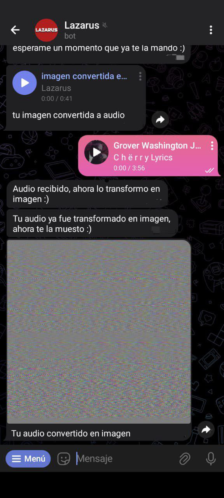

# Lazarus - Telegram Bot

**Lazarus** es un bot experimental para Telegram que transforma audios en imágenes glitch y viceversa: convierte imágenes en audios distorsionados. Es ideal para experimentar con la transferencia creativa de información entre medios y explorar los límites del arte digital.

---

## ¿Qué hace Lazarus?

- **Convierte audios mp3 en imágenes glitch**: Envía un audio y recibirás una imagen generada a partir de ese audio.
- **Convierte imágenes en audios distorsionados**: Envía una imagen y el bot te responderá con un audio basado en sus datos binarios RGB.
- El proceso es unidireccional (por ahora): los audios generados a partir de imágenes suenan caóticos y las imágenes de los audios suelen ser glitch, no se puede recuperar el archivo original desde el convertido.

---

## Tecnologías y librerías

- **Python** como lenguaje principal.
- [Pyrogram](https://docs.pyrogram.org/) + [tgcrypto](https://github.com/pyrogram/tgcrypto): para la gestión del bot en Telegram.
- [Pydub](https://github.com/jiaaro/pydub): para la manipulación de audios (requiere [ffmpeg](https://ffmpeg.org/) instalado).
- [Pillow](https://python-pillow.org/) y [Numpy](https://numpy.org/): para procesar imágenes.
- [Flask](https://flask.palletsprojects.com/): Para exponer el bot en la web y permitir alojarlo en un servidor, gestionando solicitudes HTTP si decides integrarlo o desplegarlo online.

---

## Instalación

1. **Clona el repositorio**
   ```sh
   git clone https://github.com/Snex-21/Lazarus.git
   ```
1.5. **(Recomendado) Crea un entorno virtual**
   ```sh
   python -m venv venv
   ```
   ```sh
   source venv/bin/activate  # En Linux/Mac
   ```
   ```sh
   venv\Scripts\activate     # En Windows
   ```

2. **Accede a la carpeta del bot**
   ```sh
   cd Lazarus/BOT
   ```

3. **Instala las dependencias**
   ```sh
   pip install -r requirements.txt
   ```

4. **Instala ffmpeg**
   - En Windows: [Descargar aquí](https://ffmpeg.org/download.html)
   - En Linux: `sudo apt install ffmpeg`
   - En Mac: `brew install ffmpeg`

5. **Crea el archivo de configuración `.env`**
   - Renombra `.env.exemple` a `.env`
   - Completa con tus datos:
     ```
     token_bot = la token del bot que se consigue en botfather
     # se consiguen en https://my.telegram.org/ ,iniciar sesion, ir a API development tools, completar
     # el formulario, guardar y usar los valores de API ID y API HASH
     api_id = tu api id
     api_hash = tu api hash
     ```
   - Asegúrate de tener instalado tgcrypto y un compilador de C++ si tienes problemas con la librería.

6. **Ejecuta el bot**
   ```sh
   python run.py
   ```

---

## Uso

- **Comando principal:** `/start` inicia el bot.
- **Comando secundario:** `/info` muestra instrucciones, límites y capacidades del bot (en desarrollo, puede variar).
- **Interacción:** El bot funciona sin comandos adicionales. Simplemente envía un archivo de audio o una imagen y Lazarus responderá con la conversión correspondiente.

---

## Ejemplo de interacción

- **Envía un mp3 y recibirás una imagen glitch generada a partir de ese audio:**


- **Envía una imagen y recibirás un audio distorsionado, generado a partir de los datos binarios RGB de la imagen:** 


---

## Ideas futuras

- **Recuperación bidireccional:** Poder convertir un audio mp3 en una imagen y, a partir de esa imagen, recuperar el audio original. Lo mismo para imágenes convertidas en audio.
- **Mejor calidad de audio:** Lograr que los audios generados desde imágenes sean menos "feos" o caóticos, y más musicales o armónicos.
- **Mejorar la experiencia de usuario:** Más comandos, mensajes explicativos y soporte multi-plataforma.
- **Soporte para grupos:** extender el funcionamiento del bot a chats grupales, adaptando los comandos y respuestas al contexto de múltiples participantes.

---

## Licencia

Este proyecto está licenciado bajo la licencia **Apache 2.0**.

---

## ¿Preguntas, sugerencias o bugs?

Abre un [issue](https://github.com/Snex-21/Lazarus/issues) en el repositorio.

---

>**Hecho con gusto y dedicación por Snex**