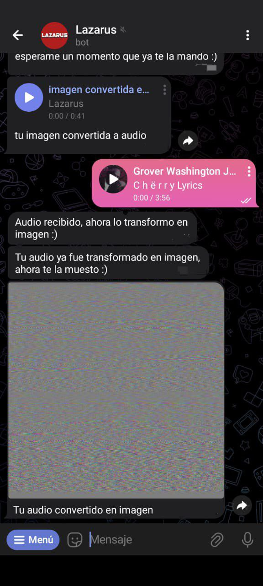
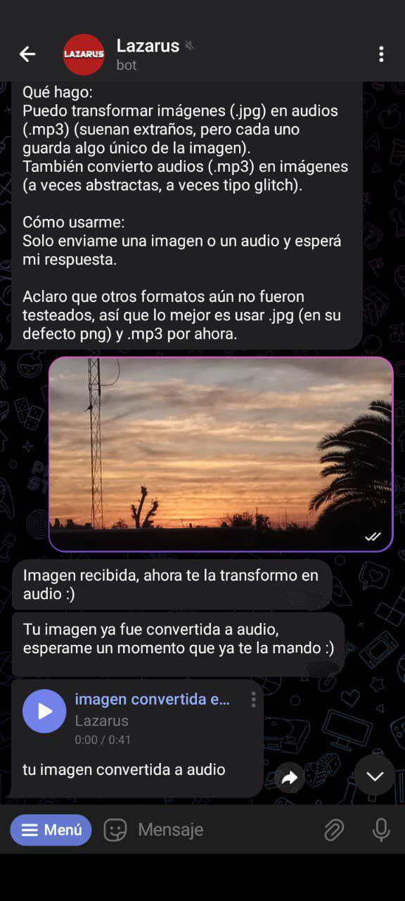

# Lazarus - Telegram Bot

**Lazarus** es un bot experimental para Telegram que transforma imágenes en audios y audios en imágenes. La característica central del proyecto ya no es solo la transformación artística: ahora también incluye una la **recuperación bidireccional**, es decir, el bot puede identificar archivos generados por él y reconstruir el original sin pérdida dentro de la lógica del proyecto.


---

## ¿Qué hace Lazarus?

- **Convierte imágenes en audio**: Envía una imagen y Lazarus la transforma en un archivo WAV que contiene la información de sus píxeles.
- **Convierte audios en imagen**: Envía un audio y el bot genera una imagen PNG con datos estructurados a partir de sus muestras.
- **Recuperación bidireccional**: Si reenvías un archivo generado por el bot, Lazarus reconstruye el archivo original dentro del esquema reversible diseñado para el proyecto.

---

## Tecnologías y librerías

- **Python** como lenguaje principal.
- [Pyrogram](https://docs.pyrogram.org/) + [tgcrypto](https://github.com/pyrogram/tgcrypto): para la gestión del bot en Telegram.
- [Pydub](https://github.com/jiaaro/pydub): para la manipulación de audios (requiere [ffmpeg](https://ffmpeg.org/) instalado).
- [Pillow](https://python-pillow.org/) y [Numpy](https://numpy.org/): para procesar imágenes.
- [Flask](https://flask.palletsprojects.com/): Para exponer el bot en la web y permitir alojarlo en un servidor, gestionando solicitudes HTTP si decides integrarlo o desplegarlo online.

---

## Instalación

1. **Clona el repositorio**
   ```sh
   git clone https://github.com/Snex-21/Lazarus.git
   ```

1.5. **(Recomendado) Crea un entorno virtual**
   ```sh
   python -m venv venv
   ```
   ```sh
   source venv/bin/activate  # En Linux/Mac
   ```
   ```sh
   venv\Scripts\activate     # En Windows
   ```

2. **Accede a la carpeta del proyecto**
   ```sh
   cd Lazarus
   ```

3. **Instala las dependencias**
   ```sh
   pip install -r requirements.txt
   ```

4. **Instala ffmpeg**
   - En Windows: [Descargar aquí](https://ffmpeg.org/download.html)
   - En Linux: `sudo apt install ffmpeg`
   - En Mac: `brew install ffmpeg`

5. **Crea el archivo de configuración `.env`**
   - Renombra `src/claves/.env.example` a `src/claves/.env` (o colócalo en la raíz)
   - Completa con tus datos:
     ```
     token_bot = la token del bot que se consigue en botfather
     # se consiguen en https://my.telegram.org/ ,iniciar sesion, ir a API development tools, completar
     # el formulario, guardar y usar los valores de API ID y API HASH
     api_id = tu api id
     api_hash = tu api hash
     ```
   - Asegúrate de tener instalado tgcrypto y un compilador de C++ si tienes problemas con la librería.

6. **Ejecuta el bot**
   ```sh
   python main.py
   ```

---

## Uso

- **Comando principal:** `/start` inicia el bot.
- **Comando secundario:** `/info` muestra información general del sistema.
- **Interacción habitual:** envía una imagen o un audio y Lazarus responderá con el flujo correspondiente.
- **Recuperación**: si reenvías un archivo que había sido generado por Lazarus, el bot reconstruye el original usando la lógica reversible implementada en el conversor.

---

## Cómo funciona la recuperación bidireccional

La idea central del proyecto es que el archivo generado no sea solo una transformación estética, sino una versión que contiene datos estructurados del original. En otras palabras:

- una imagen se codifica en un audio con la información necesaria para reconstruirla;
- un audio se codifica en una imagen con la información necesaria para reconstruirlo;
- si ese archivo generado vuelve al bot, Lazarus reconoce la estructura y reconstruye el archivo original dentro del esquema del proyecto.

Esto no es una restauración de un archivo comprimido o de un formato que se haya degradado por compresión externa; es una operación deliberada basada en la preservación de la estructura de datos que el bot genera.

---

## Ejemplo de interacción

- **Envía un mp3 y recibirás una imagen glitch generada a partir de ese audio:**


- **Envía una imagen y recibirás un audio distorsionado o armonico, generado a partir de los datos binarios RGB de la imagen:** 


---

## Estado actual del proyecto

El proyecto cuenta con las siguientes funcionalidades clave:

- **Conversión de imagen a audio con modalidades**:
  - **Audio Distorsionado (PCM Raw)**: Ruido de datos binarios directos.
  - **Audio Armónico (Musical)**: Generación musical ambient con escalas pentatónicas manteniendo reversibilidad bidireccional.
- **Selección interactiva por botones**: Menú de teclado *Inline* para elegir la modalidad deseada al enviar una imagen.
- **Conversión de audio a imagen**: Generación de imágenes *glitch art* a partir de muestras PCM.
- **Reconocimiento y recuperación bidireccional**: Restauración sin pérdida bit a bit de archivos reenviados.

---

## Ideas futuras

- [x] **Recuperación bidireccional:** Implementado 
- [x] **Mejor calidad de audio**: Implementado (generación de audios armónicos/musicales mediante LSB en síntesis de tonos pentatónicos).
- [x] **Mejorar la experiencia de usuario**: Implementado (menú interactivo con Inline Keyboards para elegir modalidad).
- [ ] **Soporte para más formatos**: Ampliar la compatibilidad y la lógica de importación/exportación sin perder integridad.
- [ ] **Soporte para grupos**: Extender la funcionalidad a chats grupales y adaptar la lógica al contexto del chat.

---

## Licencia

Este proyecto está licenciado bajo la licencia **Apache 2.0**.

---

## ¿Preguntas, sugerencias o bugs?

Abre un [issue](https://github.com/Snex-21/Lazarus/issues) en el repositorio.

---

>**Hecho con gusto y dedicación por Snex**